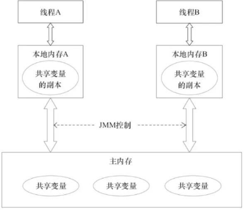

# volatile 是 Java 虚拟机提供的轻量级的同步机制

- 保证可见性
- 禁止指令排序
- 不保证原子性
JMM（Java 内存模型）

JMM 本身是一种抽象的概念并不是真实存在，它描述的是一组规定或则规范，通过这组规范定义了程序中的访问方式。

JMM 同步规定

线程解锁前，必须把共享变量的值刷新回主内存
线程加锁前，必须读取主内存的最新值到自己的工作内存
加锁解锁是同一把锁
由于 JVM 运行程序的实体是线程，而每个线程创建时 JVM 都会为其创建一个工作内存，工作内存是每个线程的私有数据区域，而 Java 内存模型中规定所有变量的储存在主内存，主内存是共享内存区域，所有的线程都可以访问，但线程对变量的操作（读取赋值等）必须都工作内存进行看。

首先要将变量从主内存拷贝的自己的工作内存空间，然后对变量进行操作，操作完成后再将变量写回主内存，不能直接操作主内存中的变量，工作内存中存储着主内存中的变量副本拷贝，前面说过，工作内存是每个线程的私有数据区域，因此不同的线程间无法访问对方的工作内存，线程间的通信(传值)必须通过主内存来完成。

#### 内存模型图



#### 三大特性：

* 可见性
* 原子性
* 有序性

*（1）可见性，如果不加 volatile 关键字，则主线程会进入死循环，加 volatile 则主线程能够退出，说明加了 volatile 关键字变量，当有一个线程修改了值，会马上被另一个线程感知到，当前值作废，从新从主内存中获取值。对其他线程可见，这就叫可见性。*

```
/**
 * @author: 【 bright 】
 * @date: 【 2021/4/19 0019 11:30 】
 * @Description :
 */
public class Test {
    volatile int number = 0;

    private void add() {
        this.number = 60;
    }

    public static void main(String[] args) {
        Test test = new Test();
        new Thread(() -> {
            try {
                Thread.sleep(3000);
                test.add();
                System.out.println(Thread.currentThread().getName() + "\t" + test.number);
            } catch (InterruptedException e) {
                e.printStackTrace();
            }
        }, "AAA").start();

        while (test.number == 0) {

        }
        System.out.println(Thread.currentThread().getName() + "\t" + test.number);
    }
}


```

*（2）原子性，发现下面输出不能得到 20000。*
```
解决原子性问题 synchronized 或者使用原子类

/**
 * @author: 【 bright 】
 * @date: 【 2021/4/19 0019 11:30 】
 * @Description :
 */
public class Test {
    volatile int number = 0;

    private synchronized void add() {
        number++;
    }

    public static void main(String[] args) throws InterruptedException {
        Test test = new Test();
        for (int i = 1; i <= 20; i++) {
            new Thread(() -> {
                for (int j = 1; j <= 1000; j++) {
                    test.add();
                }
            }, String.valueOf(i)).start();
        }
        //需要等待20个线程计算完
        while (Thread.activeCount() > 2) {
            Thread.yield();
        }
        System.out.println(Thread.currentThread().getName() + test.number);
    }
}

```

```
import java.util.concurrent.atomic.AtomicInteger;

/**
 * @author: 【 bright 】
 * @date: 【 2021/4/19 0019 11:30 】
 * @Description :
 */
public class Test {

    AtomicInteger atomicInteger = new AtomicInteger();

    private void add() {
        atomicInteger.getAndIncrement();
    }

    public static void main(String[] args) throws InterruptedException {
        Test test = new Test();
        for (int i = 1; i <= 20; i++) {
            new Thread(() -> {
                for (int j = 1; j <= 1000; j++) {
                    test.add();
                }
            }, String.valueOf(i)).start();
        }
        //需要等待20个线程计算完
        while (Thread.activeCount() > 2) {
            Thread.yield();
        }
        System.out.println(Thread.currentThread().getName() + test.atomicInteger);
    }
}

```

*（3）禁止指令重排*
* 计算机在执行程序时，为了提高性能，编译器个处理器常常会对指令做重排，一般分为以下 3 种
   * 编译器优化的重排
   * 指令并行的重排
   * 内存系统的重排
* 单线程环境里面确保程序最终执行的结果和代码执行的结果一致
* 处理器在进行重排序时必须考虑指令之间的数据依赖性
* 多线程环境中线程交替执行，由于编译器优化重排的存在，两个线程中使用的变量能否保证用的变量能否一致性是无法确定的，结果无法预测

代码示例
```
public class ReSortSeqDemo {
    int a = 0;
    boolean flag = false;

    public void method01() {
        a = 1;           // flag = true;
        // ----线程切换----
        flag = true;     // a = 1;
    }

    public void method02() {
        if (flag) {
            a = a + 3;
            System.out.println("a = " + a);
        }
    }
}
```
如果两个线程同时执行，method01 和 method02 如果线程 1 执行 method01 重排序了，然后切换的线程 2 执行 method02 就会出现不一样的结果。

禁止指令排序

volatile 实现禁止指令重排序的优化，从而避免了多线程环境下程序出现乱序的现象

先了解一个概念，内存屏障（Memory Barrier）又称内存栅栏，是一个 CPU 指令，他的作用有两个：

保证特定操作的执行顺序
保证某些变量的内存可见性（利用该特性实现 volatile 的内存可见性）
由于编译器个处理器都能执行指令重排序优化，如果在指令间插入一条 Memory Barrier 则会告诉编译器和 CPU，不管什么指令都不能个这条 Memory Barrier 指令重排序，也就是说通过插入内存屏障禁止在内存屏障前后执行重排序优化。内存屏障另一个作用是强制刷出各种 CPU 缓存数据，因此任何 CPU 上的线程都能读取到这些数据的最新版本。

下面是保守策略下，volatile写插入内存屏障后生成的指令序列示意图：


下面是在保守策略下，volatile读插入内存屏障后生成的指令序列示意图：


线程安全性保证

* 工作内存与主内存同步延迟现象导致可见性问题
   * 可以使用 synchronzied 或 volatile 关键字解决，它们可以使用一个线程修改后的变量立即对其他线程可见
* 对于指令重排导致可见性问题和有序性问题
   * 可以利用 volatile 关键字解决，因为 volatile 的另一个作用就是禁止指令重排序优化

   你在哪些地方用到过 volatile？单例

多线程环境下可能存在的安全问题，发现构造器里的内容会多次输出

```
@NotThreadSafe
public class Singleton01 {
    private static Singleton01 instance = null;
    private Singleton01() {
        System.out.println(Thread.currentThread().getName() + "  construction...");
    }
    public static Singleton01 getInstance() {
        if (instance == null) {
            instance = new Singleton01();
        }
        return instance;
    }

    public static void main(String[] args) {
        ExecutorService executorService = Executors.newFixedThreadPool(10);
        for (int i = 0; i < 10; i++) {
            executorService.execute(()-> Singleton01.getInstance());
        }
        executorService.shutdown();
    }
}
```
双重锁单例

```
public class Singleton02 {
    private static volatile Singleton02 instance = null;
    private Singleton02() {
        System.out.println(Thread.currentThread().getName() + "  construction...");
    }
    public static Singleton02 getInstance() {
        if (instance == null) {
            synchronized (Singleton01.class) {
                if (instance == null) {
                    instance = new Singleton02();
                }
            }
        }
        return instance;
    }

    public static void main(String[] args) {
        ExecutorService executorService = Executors.newFixedThreadPool(10);
        for (int i = 0; i < 10; i++) {
            executorService.execute(()-> Singleton02.getInstance());
        }
        executorService.shutdown();
    }
}
```
如果没有加 volatile 就不一定是线程安全的，原因是指令重排序的存在，加入 volatile 可以禁止指令重排。原因是在于某一个线程执行到第一次检测，读取到的 instance 不为 null 时，instance 的引用对象可能还没有完成初始化。instance = new Singleton() 可以分为以下三步完成。

memory = allocate();  // 1.分配对象空间

instance(memory);     // 2.初始化对象

instance = memory;    // 3.设置instance指向刚分配的内存地址，此时instance != null

步骤 2 和步骤 3 不存在依赖关系，而且无论重排前还是重排后程序的执行结果在单线程中并没有改变，因此这种优化是允许的，发生重排。

> memory = allocate();  // 1.分配对象空间

> instance = memory;    // 3.设置instance指向刚分配的内存地址，此时instance != null，但对象还没有初始化完成

> instance(memory);     // 2.初始化对象